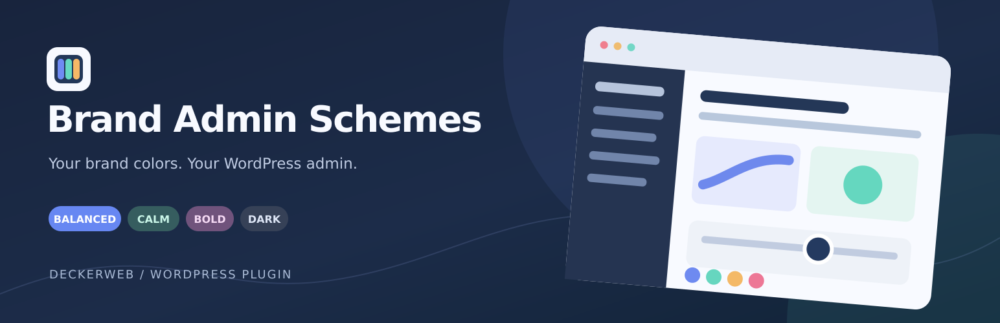

# Brand Admin Schemes

**Your colors. Your WordPress.** Turn a few brand colors into a familiar WordPress admin, a welcoming login screen, and browser tabs you can tell apart. Use Core Framework, Bricks Builder, Automatic.css, or your own palette. Explore the mood and brand strength, preview, then save. No CSS homework.

**Version:** 0.16.2 · **Requires:** WordPress 6.4+ / PHP 8.0+ · **License:** GPL v2 or later

[Download](https://github.com/deckerweb/brand-admin-schemes/releases/latest) · [User guide](https://github.com/deckerweb/brand-admin-schemes/wiki/English) · [Deutsch](README-de.md)

## Contents

- [At a glance](#at-a-glance)
- [Installation and first scheme](#installation-and-first-scheme)
- [Brand colors and admin schemes](#brand-colors-and-admin-schemes)
- [Contextual browser tab icons](#contextual-browser-tab-icons)
- [Login and toolbar](#login-and-toolbar)
- [Import, export, and Gutenberg](#import-export-and-gutenberg)
- [Updates and documentation](#updates-and-documentation)
- [FAQ](#faq)
- [Changelog](#changelog)
- [About](#about)

## At a glance

- **Make the admin yours:** four moods, a brand strength slider, hover and keyboard previews, and up to 30 named schemes.
- **Use an existing palette:** optional Core Framework, Bricks, and ACSS integrations; manual colors always work.
- **Welcome your client:** responsive login layouts, a logo or small banner, a background photo or nine smooth gradients, editable text, and an optional quote.
- **Recognize every browser tab:** separate favicons for the website, admin, and recognized builder editor.
- **Spot the environment:** compact Local, Development, Staging, and Live badges on the frontend and backend toolbar, with matching colors and optional favicon markers.
- **Work across projects:** JSON settings, agency ZIP packages with supported login images, source-color comparison, Undo, and unsaved-change reminders.
- **Keep WordPress familiar:** optional default schemes, frontend toolbar colors, Gutenberg palette entries, bundled German translations, and regular WordPress updates.

## Installation and first scheme

1. Download the **plugin ZIP** from [GitHub Releases](https://github.com/deckerweb/brand-admin-schemes/releases/latest).
2. Upload it via **Plugins → Add New → Upload Plugin** and activate it.
3. Open **Settings → Brand Admin Schemes**, choose a palette, and adjust the mood and brand strength.
4. Hover or focus a scheme card to preview it. Select your favorite, optionally name it, and save using the sticky toolbar.
5. Use **Reload page** to see the saved result throughout the current admin screen.

Everything is managed on one settings page. Login styling and generated tab icons are optional; enable and save them when you are ready.

## Brand colors and admin schemes

Map colors to **Primary, Secondary, Tertiary, and Accent**. Three colors are enough: the plugin can derive Tertiary. The mood and slider create suitable tones for menus, the toolbar, buttons, and links. You can keep personal user choices, offer a default, or apply the active scheme to everyone.

Saved colors remain available if their provider is removed. When source colors change, compare the old and new palette before saving an update. The sample contrast check helps you review readability.

## Contextual browser tab icons

See at a glance whether a browser tab contains the **public website**, **WordPress admin**, or **builder editor**. Create a favicon from a short abbreviation or an outline symbol, with palette colors or your own colors. Presets recognize Bricks, Elementor, and Oxygen editor contexts where supported.

You may retain the existing WordPress Site Icon on the frontend. Optional environment letters make Local, Development, Staging, and Live tabs easier to distinguish. The feature changes the browser-tab icon, not the Site Icon stored in WordPress.

## Login and toolbar

The login design follows your active palette. Choose a split or centered layout, then add an optional photo, logo, or small banner. The Site Icon, website title, and tagline provide useful defaults. Nine gradient choices and an optional quote complete the visual panel. Check Desktop, Tablet, and Mobile previews before saving.

The frontend toolbar can use a palette color adjusted to your chosen mood. A compact environment badge appears on frontend and backend toolbars. Detection includes WordPress environment settings, Local app `.local` sites, and localhost addresses; manual selection and custom status colors are available.

## Import, export, and Gutenberg

Move settings and saved schemes as **JSON**, or include supported local login images in an **agency ZIP**. Review imported settings and save to apply them. ZIP imports add bundled images to the Media Library immediately and require PHP ZipArchive. SVG images are excluded from these packages.

Optionally add the four named brand colors to Gutenberg alongside the theme palette. Existing content keeps its colors.

## Updates and documentation

Updates come directly from the [DECKERWEB plugin repository on GitHub](https://github.com/deckerweb/brand-admin-schemes/releases) and appear in the **regular WordPress plugin update system**. Update from the Plugins or Updates screen as usual; no additional updater plugin is needed.

The [English wiki guide](https://github.com/deckerweb/brand-admin-schemes/wiki/English) and [German wiki guide](https://github.com/deckerweb/brand-admin-schemes/wiki/Deutsch) cover every setting, palette sources, login images, tab icons, and common questions. Local documentation and the changelog are available in the settings footer. German is included and follows the WordPress site or user language.

## FAQ

**Do I need Core Framework, Bricks, or ACSS?** No. Enter your own colors; palette providers are optional.

**What happens if I disable a palette provider?** Saved scheme colors remain available. The provider is needed to read a fresh palette, not to display saved colors.

**Does this change my website or builder design?** It styles the admin shell, optional login and toolbar, and browser-tab icons. Page content and builder canvases keep their design; Gutenberg palette entries only add choices.

**Do I need a logo and a background photo?** No. The Site Icon, theme logo, and site name provide fallbacks; palette gradients work without a photo.

**Does it replace the WordPress Site Icon?** No. It generates contextual browser-tab favicons without changing the stored Site Icon. You can retain the original frontend favicon.

**Does importing immediately change the live design?** No. Review the imported settings and save to apply them. Agency ZIP imports do add bundled images to the Media Library immediately.

**How do updates work?** Updates come from the public DECKERWEB GitHub repository through the regular WordPress plugin update system. No extra updater plugin is required.

[More answers by topic](https://github.com/deckerweb/brand-admin-schemes/wiki/FAQ-English)

## Changelog

### 0.16.2

- **Improved:** Refreshes all four readmes with clear feature summaries, seven short FAQs, and the latest five version entries.
- **Improved:** Adds a German GitHub banner and expands the bilingual Wiki with 49 themed FAQ answers per language and complete changelogs.
- **Improved:** Adds checked contents links, presents browser-tab favicons alongside the main features, and explains GitHub updates through the regular WordPress update system.
- **Misc:** Packages the updated English and German documentation with this release.

### 0.16.1

- **Improved:** Adopts the Daily Scripture footer layout, adds a documentation link beside the changelog, and includes a translated brand slogan.
- **Misc:** Sets the DECKERWEB copyright range to 2022–2026 throughout the plugin and documentation.

### 0.16.0

- **New:** Adds a compact settings footer with local documentation and changelog dialogs.
- **Improved:** Includes matching English and German Markdown and WordPress-style text readmes.
- **Improved:** Groups each release by New, Improved, Fixed, and Misc, in that order.
- **Fixed:** Corrects the frontend-toolbar checkbox markup, translates missing German error messages, and registers three missing JavaScript translation labels.
- **Misc:** Adds a license file, release notes and repository packaging rules.

### 0.15.1

- **Improved:** Refreshes the short plugin description and GitHub documentation for the full feature set.
- **Misc:** Adds two banner concepts and two matching icon concepts as SVG and PNG design alternatives.

### 0.15.0

- **New:** Marks unsaved editor changes and asks before a reload or navigation would discard them.
- **New:** Adds optional environment letters to generated browser favicons for Local, Development, Staging and Live.
- **New:** Adds a contrast audit near the scheme cards with suggested text or background colors when a sample falls below 4.5:1.
- **New:** Exports a ZIP agency package with settings and supported local raster images, and imports it for review. Imported images are added to the Media Library immediately. SVG assets remain outside the bundle. Requires PHP ZipArchive.
- **New:** Adds optional Gutenberg palette entries for the four brand roles while preserving existing theme colors.

[Full changelog in the wiki](https://github.com/deckerweb/brand-admin-schemes/wiki/Changelog-English) · [Releases](https://github.com/deckerweb/brand-admin-schemes/releases)

## About

Built by **David Decker – DECKERWEB** to make client sites feel familiar on both sides of the login screen. Ideas behind the plugin grew from snippets used since 2022.

The scheme styles the WordPress admin shell; third-party CSS can affect individual elements. Gutenberg content and builder canvases keep their own design. SVG login images require Safe SVG and administrator confirmation. More details are in the wiki.

Have an idea or found an issue? [Let us know on GitHub](https://github.com/deckerweb/brand-admin-schemes/issues).

© 2022–2026 David Decker – DECKERWEB · [GPL v2 or later](LICENSE)
